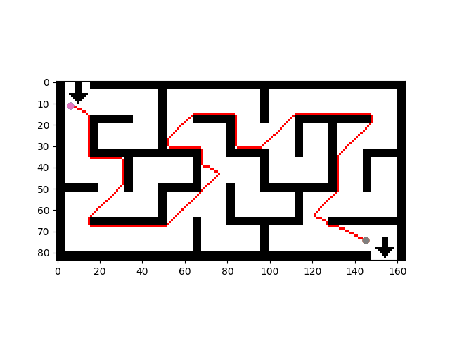
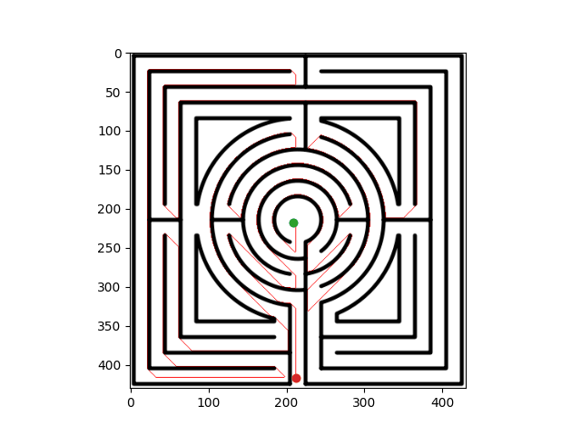
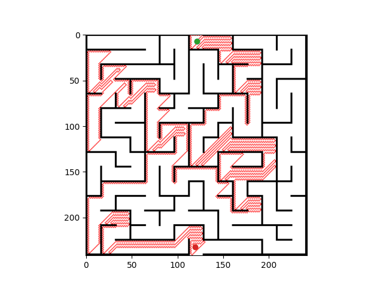
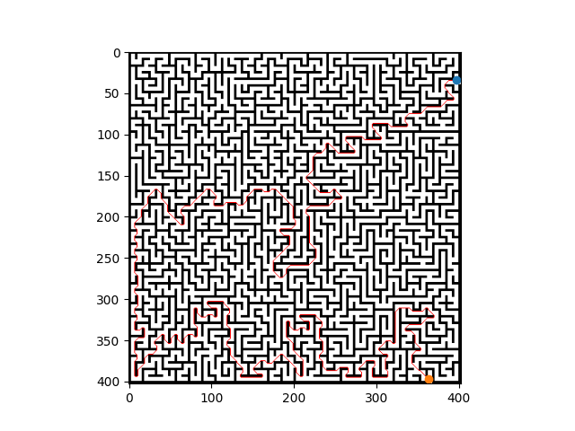
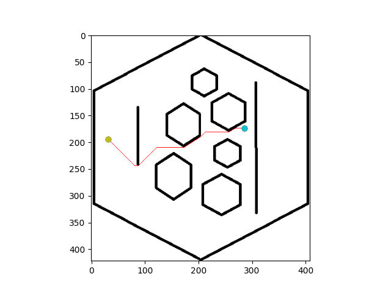

# Autonomous-Robots

In this repository you can find the last assignment from the Autonomous Robots course of the M. Sc. in Artificial Intelligence at the Technical University of Madrid.

It consisted on implementing a path planning algorithm and test it with real examples.

## Algorithms

We have implemented and tested the following algorithms:
+ Value Iteration
+ Dijkstra
+ A*
+ Depth First Search
+ Best First Search

## Worlds

We have tested our algorithms using different environment configurations.

## Outputs

You can observe below some examples of the paths obtained by our implementation.

### A*

### Best First Search

### Depth First Search 

### Dijkstra

### Value Iteration
